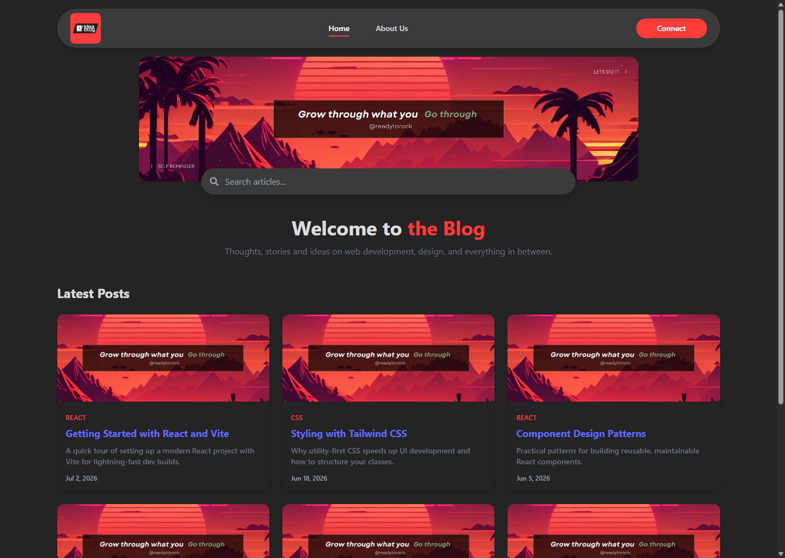

# Blog React Tailwind

A simple, responsive blog landing page built with React, Vite, and Tailwind CSS.



## Features

- Responsive header with a mobile slide-in navigation drawer
- Client-side routing with Home, About, and a custom 404 page
- Hero/search section with a live search bar
- Blog post grid with sample data, filterable by the search query
- Clean, utility-first styling with Tailwind CSS

## Tech Stack

- [React 18](https://react.dev/)
- [Vite](https://vitejs.dev/) — dev server & build tool
- [React Router](https://reactrouter.com/) — client-side routing
- [Tailwind CSS](https://tailwindcss.com/) — styling
- [react-icons](https://react-icons.github.io/react-icons/) — icons
- ESLint — linting

## Getting Started

### Prerequisites

- Node.js 18+
- npm

### Installation

```bash
git clone https://github.com/<your-username>/blog-react-tailwind.git
cd blog-react-tailwind
npm install
```

### Development

```bash
npm run dev
```

Starts the Vite dev server with hot module reloading (default: http://localhost:5173).

### Build

```bash
npm run build
```

Outputs a production build to `dist/`.

### Preview production build

```bash
npm run preview
```

### Lint

```bash
npm run lint
```

## Project Structure

```
src/
├── assets/images/       # Static images (logo, banner)
├── data/
│   └── posts.js          # Sample blog post data
├── components/
│   ├── Layout.jsx         # Shared Header + Footer page shell
│   ├── Header.jsx         # Nav bar + mobile sidebar
│   ├── Search.jsx         # Banner + search input
│   ├── IntroPost.jsx      # Hero intro text
│   ├── Blogs.jsx          # Blog post grid
│   └── Footer.jsx         # Site footer
├── pages/
│   ├── Home.jsx            # Composes the page from the components above
│   ├── About.jsx           # About page
│   ├── Contact.jsx         # Contact form
│   ├── BlogPost.jsx        # Single blog post detail view
│   └── NotFound.jsx        # 404 page (catch-all route)
├── App.jsx                  # Route definitions
└── main.jsx                  # Wraps App in BrowserRouter
```

## Routes

| Path        | Page                |
| ----------- | ------------------- |
| `/`         | Home                |
| `/about`    | About               |
| `/contact`  | Contact             |
| `/blog/:id` | Blog post detail    |
| `*`         | 404 Not Found       |
